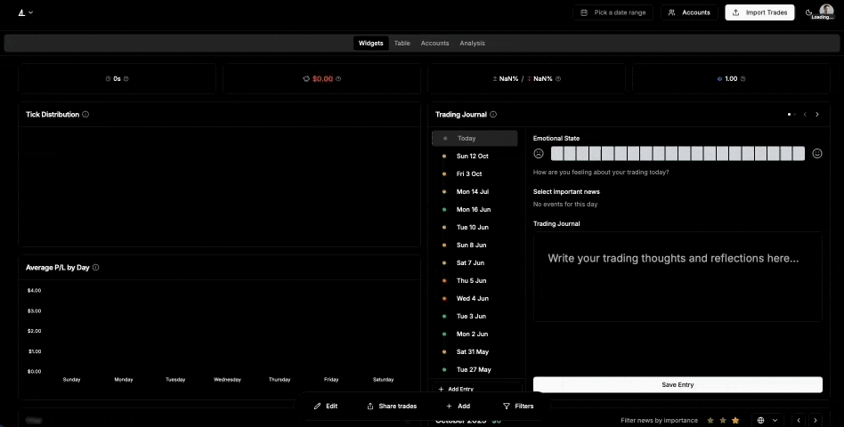

# Deltalytix

<div align="center">
  
  
  <h3>Open-source trading analytics platform for professional traders</h3>
  
  [](https://creativecommons.org/licenses/by-nc/4.0/)
  [](https://nextjs.org/)
  [](https://reactjs.org/)
  [](https://www.typescriptlang.org/)
  [](https://discord.gg/a5YVF5Ec2n)
  
  [🚀 Live Demo](#) • [📖 Documentation](#) • [💬 Discord Community](https://discord.gg/a5YVF5Ec2n) • [🐛 Report Bug](https://github.com/hugodemenez/deltalytix/issues)
</div>

---
## ✨ Key Features

  <div align="center">
  
</div>

### 📊 Advanced Trading Analytics
- **Real-time PnL tracking** with customizable performance metrics
- **Interactive dashboards** with drag-and-drop widget layouts
- **Comprehensive trade analysis** with decile statistics and pattern recognition
- **Customizable chart views** supporting multiple timeframes and indicators

<!-- TODO: Add GIF showing dashboard overview with customizable widgets -->

### 🔗 Multi-Broker Integration
- **Tradovate sync** for real-time trade data synchronization
- **Rithmic sync** via proprietary service integration
- **Built-in integrations** for FTMO, ProjectX, ATAS, and Interactive Brokers (IBKR)
- **AI-powered file parsing** for any broker format when specific integration doesn't exist yet

<!-- TODO: Add GIF showing CSV import flow with AI field mapping -->

### 🤖 AI-Powered Insights
- **Intelligent field mapping** for seamless data imports
- **Sentiment analysis** of trading patterns and market conditions
- **Automated trade journal** with AI-generated insights
- **Pattern recognition** for identifying trading opportunities

<!-- TODO: Add GIF showing AI chat assistant helping with trade analysis -->

### 🌍 Internationalization
- **Full i18n support** with English and French translations
- **Extensible translation system** using next-international
- **Locale-aware formatting** for dates, numbers, and currencies
- **RTL language support** ready for future expansion

### ⚡ Modern Technology Stack
- **Next.js 15** with App Router for optimal performance
- **React 19** with latest concurrent features
- **TypeScript** for type-safe development
- **Prisma ORM** for database operations
- **Supabase** for authentication and real-time features

<!-- TODO: Add GIF showing dark/light theme switching and mobile responsive design -->

---

## 🛠️ Tech Stack & Architecture

### Frontend
- **Framework**: Next.js 15 (App Router)
- **UI Library**: React 19 with TypeScript
- **Styling**: Tailwind CSS with custom design system
- **Animations**: Framer Motion with performance optimizations
- **State Management**: Zustand stores + React Context
- **Internationalization**: next-international

### Backend
- **API**: Next.js API Routes + Server Actions
- **Database**: PostgreSQL via Supabase
- **ORM**: Prisma with type-safe queries
- **Authentication**: Supabase Auth (Discord OAuth, Email)
- **Real-time**: WebSocket connections for live data

### External Services
- **Payments**: Stripe integration with webhooks
- **AI/ML**: OpenAI API for analysis and field mapping
- **Storage**: Supabase Storage for file uploads
- **Broker Syncs**: Tradovate API, Rithmic proprietary service
- **Platform Integrations**: FTMO, ProjectX, ATAS, Interactive Brokers (IBKR)
- **Deployment**: Vercel-optimized with edge functions

### Development Tools
- **Package Manager**: Bun (recommended) or npm
- **Linting**: ESLint with Next.js config
- **Type Checking**: TypeScript strict mode
- **Database Migrations**: Prisma migrations

---

## 📋 Prerequisites

Before you begin, ensure you have the following:

### Required Software
- **Node.js 20+** or **Bun** (latest version recommended)
- **Git** for version control
- **PostgreSQL** database (or use Supabase free tier)

### Required Accounts
- **Supabase account** ([free tier available](https://supabase.com))
- **Stripe account** (for payment processing)
- **OpenAI API key** (for AI features)
- **Discord application** (for OAuth authentication)

---

## 🚀 Installation & Setup

### Step 1: Clone and Install

```bash
git clone https://github.com/hugodemenez/deltalytix.git
cd deltalytix
npm install  # or bun install
```

### Step 2: Environment Variables

Create a `.env.local` file in the root directory with the following variables:

```env
# Supabase Configuration
NEXT_PUBLIC_SUPABASE_URL=your_supabase_url
NEXT_PUBLIC_SUPABASE_ANON_KEY=your_supabase_anon_key
SUPABASE_SERVICE_ROLE_KEY=your_supabase_service_role_key

# Database
DATABASE_URL=your_postgresql_connection_string

# OpenAI
OPENAI_API_KEY=your_openai_api_key

# Stripe
NEXT_PUBLIC_STRIPE_PUBLISHABLE_KEY=your_stripe_publishable_key
STRIPE_SECRET_KEY=your_stripe_secret_key
STRIPE_WEBHOOK_SECRET=your_stripe_webhook_secret

# Discord OAuth
DISCORD_CLIENT_ID=your_discord_client_id
DISCORD_CLIENT_SECRET=your_discord_client_secret

# Application
NEXT_PUBLIC_APP_URL=http://localhost:3000
```

### Step 3: Database Setup

```bash
# Generate Prisma client
npx prisma generate

# Push schema to database (for development)
npx prisma db push

# Or run migrations (for production)
npx prisma migrate dev

# Seed the database (optional)
npx prisma db seed
```

### Step 4: Run Development Server

```bash
npm run dev
# or
bun dev
```

Open [http://localhost:3000](http://localhost:3000) to view the application.

---

## ⚙️ Configuration Guide

### Supabase Setup
1. Create a new Supabase project
2. Enable Discord OAuth provider in Authentication settings
3. Configure Row Level Security (RLS) policies
4. Set up storage buckets for file uploads
5. Configure real-time subscriptions for live data

### Stripe Configuration
1. Create a Stripe account and get API keys
2. Set up webhook endpoints for payment processing
3. Configure products and pricing plans
4. Test webhook integration in development

### Discord OAuth Setup
1. Create a Discord application in the [Discord Developer Portal](https://discord.com/developers/applications)
2. Navigate to OAuth2 settings and add redirect URI: `http://localhost:3000/api/auth/callback/discord`
3. Copy Client ID and Client Secret to environment variables
4. Enable the `identify` and `email` scopes for user authentication

### OpenAI Integration
1. Get an API key from OpenAI
2. Configure usage limits and billing
3. Test API connectivity with the field mapping feature

---

## 📁 Project Structure

```
deltalytix/
├── app/                    # Next.js App Router
│   ├── [locale]/          # Internationalized routes
│   │   ├── dashboard/     # Main dashboard pages
│   │   ├── admin/         # Admin panel
│   │   ├── business/      # Business features
│   │   └── (landing)/     # Marketing pages
│   └── api/               # API routes
│       ├── ai/           # AI-powered endpoints
│       ├── auth/         # Authentication
│       ├── stripe/       # Payment processing
│       └── cron/         # Scheduled tasks
├── components/            # Reusable React components
│   ├── ui/               # Base UI components (Radix UI)
│   ├── ai-elements/      # AI-powered components
│   ├── emails/           # Email templates
│   └── magicui/          # Custom UI components
├── server/               # Server-side business logic
├── store/                # Zustand state management
├── prisma/               # Database schema and migrations
├── locales/              # Internationalization files (EN/FR)
├── lib/                  # Utility functions
├── hooks/                # Custom React hooks
├── context/              # React Context providers
└── content/              # MDX content for updates
```

---

## 🧑‍💻 Development Guidelines

### Code Style
- Use TypeScript strict mode
- Follow Next.js best practices
- Implement proper error handling
- Write self-documenting code

### Translation System
Use the `useI18n` hook for all user-facing text:

```typescript
import { useI18n } from "@/locales/client"

const t = useI18n()

// Basic translation
<CardTitle>{t('propFirm.title')}</CardTitle>

// Translation with variables
<DialogTitle>{t('propFirm.configurator.title', { accountNumber: account.accountNumber })}</DialogTitle>
```

### State Management
- Use Zustand stores for client-side state
- Use React Context for complex mutations
- Prefer Server Actions for data mutations
- Use API routes for public data with caching

### API Design
- **API Routes**: For public data that benefits from caching
- **Server Actions**: For mutations and private operations
- **Real-time**: Use Supabase subscriptions for live updates

---

## 🤝 Contributing

We welcome contributions to Deltalytix! Here's how you can help:

### Getting Started
1. Fork the repository
2. Create a feature branch: `git checkout -b feature/amazing-feature`
3. Make your changes and test thoroughly
4. Commit your changes: `git commit -m 'Add amazing feature'`
5. Push to the branch: `git push origin feature/amazing-feature`
6. Open a Pull Request

### Development Workflow
- Follow the existing code style and conventions
- Add tests for new features
- Update documentation as needed
- Ensure all translations are included
- Test on both desktop and mobile

### Reporting Issues
- Use GitHub Issues for bug reports
- Include steps to reproduce
- Provide system information
- Add screenshots if applicable

### Feature Requests
- Use GitHub Discussions for feature ideas
- Check existing issues before creating new ones
- Provide detailed use cases and benefits

---

## 📄 License

This project is licensed under the **Creative Commons Attribution-NonCommercial 4.0 International License (CC BY-NC 4.0)**.

### Key Points:
- ✅ **You can use, modify, and distribute this software for non-commercial purposes**
- ✅ **You must give appropriate credit and provide a link to the license**
- ✅ **You can create derivative works for non-commercial use**
- ❌ **You cannot use this software for commercial purposes**
- ❌ **You cannot distribute this software commercially without permission**

### What This Means:
This license allows you to use Deltalytix for personal, educational, and non-commercial purposes. You can modify and share the code as long as you give proper attribution and don't use it commercially.

**For commercial licensing options, please contact us.**

Read the full license text in the [LICENSE](LICENSE) file.

---

## 🆘 Support & Community

### Get Help
- 💬 **Discord Community**: [Join our Discord](https://discord.gg/a5YVF5Ec2n) for real-time support
- 📚 **GitHub Discussions**: Ask questions and share ideas
- 🐛 **Issue Tracker**: Report bugs and request features
- 📖 **Documentation**: Check our comprehensive guides

### Stay Updated
- ⭐ **Star the repository** to show your support
- 👀 **Watch for releases** to get notified of updates
- 🐦 **Follow us on social media** for announcements

---

## 🙏 Acknowledgments

### Contributors
Thank you to all the contributors who help make Deltalytix better!

### Open Source Projects
This project builds upon many excellent open source libraries:
- [Next.js](https://nextjs.org/) - The React framework
- [Supabase](https://supabase.com/) - Backend as a service
- [Prisma](https://prisma.io/) - Database toolkit
- [Tailwind CSS](https://tailwindcss.com/) - Utility-first CSS
- [Framer Motion](https://framer.com/motion/) - Animation library
- [Radix UI](https://radix-ui.com/) - Accessible component primitives

### Inspiration
Deltalytix was inspired by the need for better trading analytics tools in the open source community.

---

## 🗺️ Roadmap

### Upcoming Features
- [ ] Advanced backtesting capabilities with historical data
- [ ] Additional platform integrations (TD Ameritrade, MetaTrader, more prop firms)
- [ ] Mobile application (React Native)
- [ ] Advanced AI trading insights and recommendations
- [ ] Portfolio optimization tools
- [ ] Social trading features and community insights
- [ ] Advanced charting with custom indicators
- [ ] Risk management tools and alerts

### Long-term Vision
- [ ] Plugin system for custom indicators and strategies
- [ ] Public API for third-party integrations
- [ ] Enhanced AI field mapping for more broker formats
- [ ] Advanced reporting and analytics suite
- [ ] Community-driven platform integration contributions
- [ ] Open-source trading strategy marketplace

---

<div align="center">
  <p>Made with ❤️ by the Deltalytix community</p>
  <p>
    <a href="https://github.com/hugodemenez/deltalytix">GitHub</a> •
    <a href="https://discord.gg/a5YVF5Ec2n">Discord</a> •
    <a href="https://deltalytix.com">Website</a>
  </p>
</div>