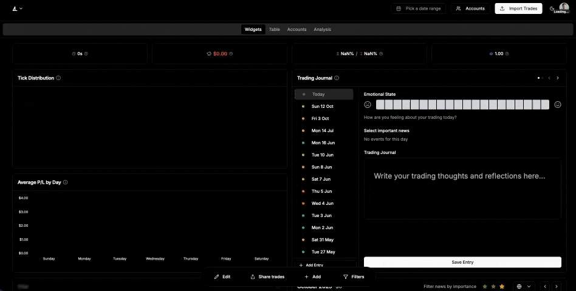

# Deltalytix

<div align="center">
  

  <h3>Open-source trading journal and analytics for futures and prop-firm traders</h3>

  [](https://creativecommons.org/licenses/by-nc/4.0/)
  [](https://nextjs.org/)
  [](https://discord.gg/a5YVF5Ec2n)

  <a href="https://trustmrr.com/startup/deltalytix" target="_blank"></a>

  [🚀 Live app](https://deltalytix.app) • [💬 Discord](https://discord.gg/a5YVF5Ec2n) • [🐛 Report a bug](https://github.com/hugodemenez/deltalytix/issues)
</div>

---

Deltalytix pulls your fills out of your broker, turns them into a performance record you can actually read, and helps you work out which of your habits are making money and which are costing it. It is built for traders juggling several funded and live accounts, where the hard part is not placing the trade but keeping an honest account of what happened afterwards.

Use it hosted at [deltalytix.app](https://deltalytix.app), or run the whole thing yourself.

<div align="center">
  
</div>

## What it does

**Get your trades in.** Direct sync for Rithmic, Tradovate, Thor, and DXfeed. File and statement import for Interactive Brokers PDFs, ATAS, FTMO, TradeZella, Quantower, Topstep, and NinjaTrader. Manual entry with commissions inferred from your history. For anything not on that list, AI field mapping reads an arbitrary CSV and works out the columns.

**See what happened.** Drag-and-drop dashboard of PnL, decile statistics, and per-account breakdowns, filterable by instrument, weekday, and date range. Calendar view with daily statistics and trade-by-trade review.

**Write it down.** A rich journal editor with tables, resizable images, and session tags, plus AI-assisted entries that focus on the mistakes and the things that went right.

**Trade together.** Team accounts with combined performance across every trader, and a prop-firm catalogue with aggregated payout and pass-rate statistics.

Available in English and French.

## Run it yourself

Requires [Bun](https://bun.sh) and Docker.

```bash
bash scripts/self-host-quickstart.sh
bash scripts/dev.sh
```

Then open <http://localhost:3000/dashboard>. The quickstart starts Postgres, writes a `.env.local` with local auth bypass enabled, and seeds a demo account so the dashboard has something to draw.

**[→ Full self-hosting runbook](./SELF_HOSTING.md)** — manual bootstrap, Docker deployment, health checks, and production notes. Copy [`.env.example`](./.env.example) for the complete list of environment variables; only `DATABASE_URL` and `DIRECT_URL` are needed for local dashboard work.

## Documentation

| | |
|---|---|
| [`SELF_HOSTING.md`](./SELF_HOSTING.md) | Deployment, configuration, and health checks |
| [`AGENTS.md`](./AGENTS.md) | Build commands, conventions, and PR checklist — for contributors and AI agents alike |
| [`SECURITY.md`](./SECURITY.md) | Reporting a vulnerability |
| [`agents/skills/`](./agents/skills/) | Shared skill library for AI coding agents |
| [deltalytix.app/updates](https://deltalytix.app/updates) | Release notes |

## Built with

Next.js 15 (App Router) and React 19 on TypeScript, Tailwind, and Radix UI. Postgres through Prisma, with Supabase for auth and storage. Zustand for client state, Server Actions for mutations. Stripe for billing, OpenAI for the AI features, Bun as the package manager.

## Roadmap

**In development**

- [ ] **Mobile optimisation** — fully responsive design with mobile-specific behaviour
- [ ] **On-premise deployment** — Dockerised self-hosting with a bundled Postgres container

**Next (Q2–Q3 2026)**

- [ ] **Deeper journaling** — session-based analysis with automated insight on recurring patterns
- [ ] **Market data** — Databento integration for real-time market context alongside your fills

Shipped work lives in the [release notes](https://deltalytix.app/updates). Longer-term ideas are tracked in [GitHub issues](https://github.com/hugodemenez/deltalytix/issues).

## Contributing

Contributions are welcome. Open pull requests against **`beta`**, not `main` — `main` is production and feature work lands on `beta` first.

```bash
bun install
bunx prisma generate
bun run typecheck && bun run lint
OPENAI_API_KEY=dummy bun run build
```

Read [`AGENTS.md`](./AGENTS.md) before your first PR: it covers the local environment, the definition of done, and the pre-PR checklist. Keep user-facing strings in [`locales/`](./locales/) and include both English and French.

Bug reports and feature ideas belong in [GitHub issues](https://github.com/hugodemenez/deltalytix/issues); questions are best asked on [Discord](https://discord.gg/a5YVF5Ec2n).

## License

[Creative Commons Attribution-NonCommercial 4.0 International](./LICENSE) (CC BY-NC 4.0).

You may use, modify, and share Deltalytix for personal, educational, and other non-commercial purposes, with attribution. Commercial use and commercial distribution require a separate licence — get in touch.

---

<div align="center">
  <p>Made with ❤️ by Hugo DEMENEZ & the Deltalytix community</p>
  <p>
    <a href="https://github.com/hugodemenez/deltalytix">GitHub</a> •
    <a href="https://discord.gg/a5YVF5Ec2n">Discord</a> •
    <a href="https://deltalytix.app">Website</a>
  </p>
</div>
