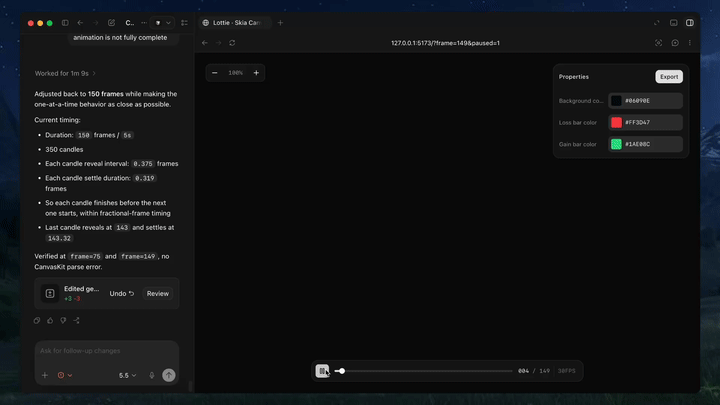
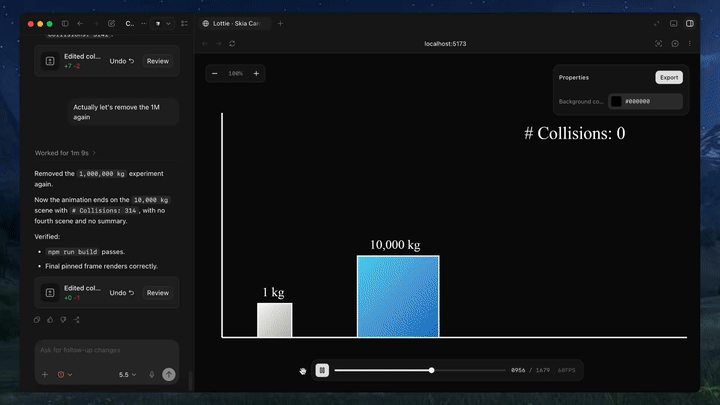

<p align="center">
  
</p>

[](https://discord.com/invite/zPQJrNGuFB)
[](https://x.com/diffusionhq)
[](https://www.ycombinator.com/companies/diffusion-studio)

**Text-to-lottie** is an open-source framework for generating production ready Lottie animations with claude code/codex or any other coding agent supporting skills.

## Created with Text-to-Lottie
<table>
  <tr>
    <td>
      
    </td>
    <td>
      
    </td>
  </tr>
</table>

## Quick Start 
Install the skill:
```bash
npx skills add diffusionstudio/lottie
```
Then ask your coding agent to generate a Lottie animation using `text-to-lottie`.

Example prompt:
> Create a Lottie animation from the SVG path in https://github.com/JaceThings/SF-Hello/blob/main/SVG/hello-en.svg. Reveal the path with an animation that follows the natural path direction. Apply a premium apple themed gradient to the path. Use ease-in-out timing, a transparent background, and preserve the original SVG geometry.

The agent sets up the workspace and the included player, where each animation lives as a scene inside a project. Scenes load automatically from `public/projects/<project>/<scene>/lottie.json` and live-update in the player as the agent edits them — so you can inspect, scrub, and refine the generated Lottie in real time.

## Prompt guide

### 1. Ground the model
Provide SVGs, real-world data, or screenshots whenever possible. Results are significantly better when the animation is based on concrete assets.

### 2. Use motion design terminology
Describe timing and movement using motion design language like ease-in, ease-out, and ease-in-out.

### 3. Think like a camera operator
Professional motion graphics often rely on camera movement. Include camera pushes, pans, zooms, and rig-like motion in your prompt. The agent can simulate these through group transforms.

### 4. Request the controls you need
By default, outputs usually only expose a background color control. If you want to customize other properties, explicitly ask the agent to create controls for them.

### 5. Specify FPS and duration
If your animation requires a specific frame rate or length, include the desired FPS and total frame count in the prompt.


## Using the Generated Animation

Generated animations can be used directly as Lottie JSON files or imported into After Effects for further refinement.

### Web / vanilla HTML
```html
<script src="https://unpkg.com/lottie-web/build/player/lottie.min.js"></script>

<div id="anim"></div>

<script>
  lottie.loadAnimation({
    container: document.getElementById("anim"),
    renderer: "svg",
    loop: true,
    autoplay: true,
    path: "/animations/my-animation.json"
  });
</script>
```

### React Native
```typescript
import LottieView from "lottie-react-native";

export default function Loader() {
  return (
    <LottieView
      source={require("./animation.json")}
      autoPlay
      loop
      style={{ width: 200, height: 200 }}
    />
  );
}
```

Alternatively, [React Native Skia](https://shopify.github.io/react-native-skia/docs/skottie/) can also render Lottie animations via its Skottie module, including on the web. It lets you customize animation properties, assets, and typographies at runtime, and since `Skottie` is a regular Skia drawing, it can be composed into a larger Skia scene alongside shaders, effects, and masks.

```typescript
import { Skia, Canvas, Skottie, useClock } from "@shopify/react-native-skia";
import { useDerivedValue } from "react-native-reanimated";

const animation = Skia.Skottie.Make(JSON.stringify(require("./animation.json")));

export default function Loader() {
  const clock = useClock();
  const frame = useDerivedValue(
    () => ((clock.value / 1000) % animation.duration()) * animation.fps()
  );
  return (
    <Canvas style={{ width: 200, height: 200 }}>
      <Skottie animation={animation} frame={frame} />
    </Canvas>
  );
}
```

### iOS Swift
```swift
import Lottie

let animationView = LottieAnimationView(name: "animation")
animationView.frame = view.bounds
animationView.contentMode = .scaleAspectFit
animationView.loopMode = .loop
view.addSubview(animationView)
animationView.play()
```

### Android Kotlin
```kotlin
val view = findViewById<LottieAnimationView>(R.id.animationView)
view.setAnimation(R.raw.animation)
view.loop(true)
view.playAnimation()
```

### Flutter
```yaml
dependencies:
  lottie: ^latest
```

```dart
import 'package:lottie/lottie.dart';

Lottie.asset('assets/animation.json')
```
